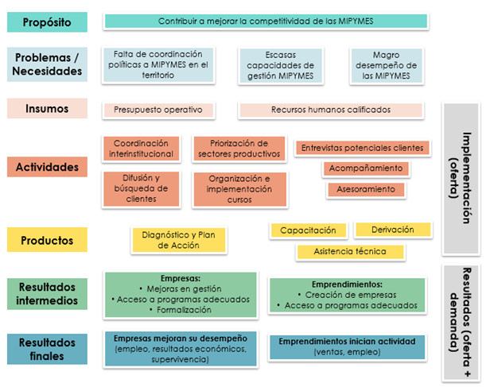
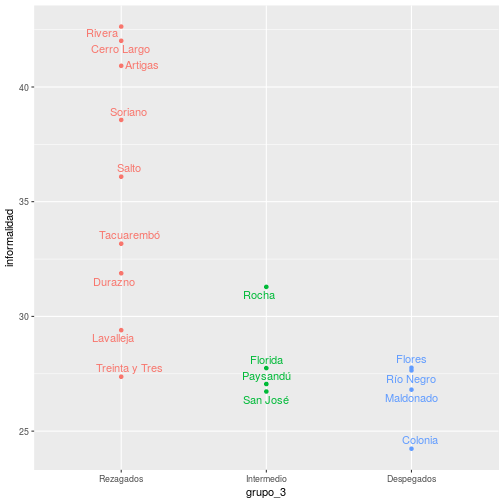
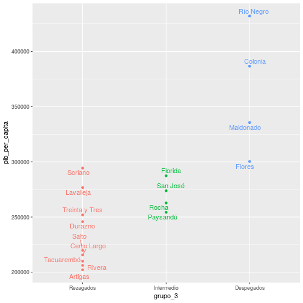
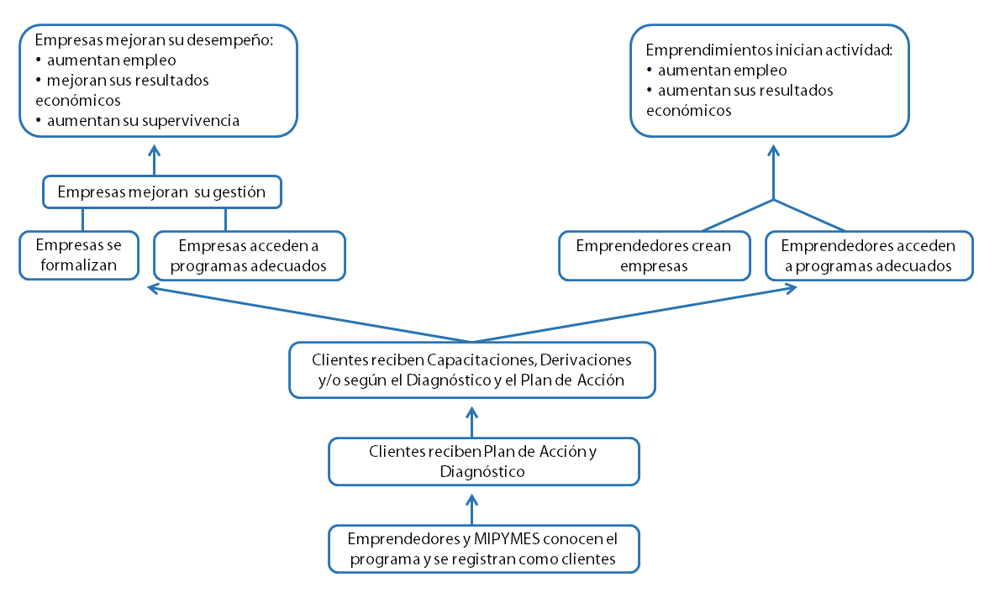
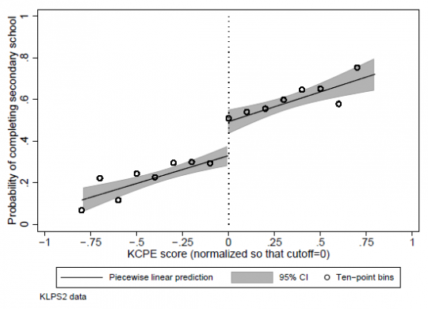
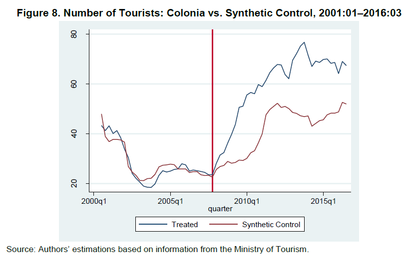

```{r setup, include=FALSE, echo = FALSE}
library(here)
library(dplyr)
library(knitr)
list.files(here())
options(htmltools.dir.version = FALSE)


```


background-image: url("background.png")


# Taller Buenas Prácticas MyE

- ¿Qué son?
- Panorama Heterogéneo
- Manual

---
# Contenidos

- Teoría del Cambio (R)
- Monitoreo de Indicadores (P)
- Evaluación (P + R)
- Checklist

---
# Teoría del Cambio

+ Explicar la lógica de un programa
+ Base para indicadores
+ Base para evaluar

---
# Teoría del Cambio



---
# Contexto

+ Describir el problema y las fuentes de información
+ CCE: Encuesta MIPYMES, PIB Regional (IDAEs), ECH
+ Tres grupos de departamentos


---
# PIB Departamental




---
# Informalidad




---
# Alcance y Foco

+ Alcance y prioridades del programa

---
# Cadenas causales

+ Es la teoría atrás de la intervención
+ Es la parte central de la TdC
+ Las flechas implican vínculos causales


---
# Cadenas Causales CCE



---
# Recursos

+ Énfasis en transparencia

---

# Actividades

+ ¿Qué hacemos?

---
# Productos

+ ¿Qué se llevan los beneficiarios?

---
# Resultados

+ ¿Qué hacen los beneficiarios con lo que les damos?
+ Más difícil de medir

---
# Impacto

+ ¿Estamos moviendo la aguja?
+ Implica cambios a mayor escala
+ Extra difícil de medir (atribución)


---
# 3 Teorías del Cambio

+ Identificar los componentes de la teoría del Cambio
+ Analizar la validez de los efectos causales
+ ¿En qué se enfoca más cada una?
+ ¿Las categorías son medibles?

---
# Evaluación

+ Ocasional
+ Planificación
+ Preguntas de evaluación
  + Descriptivas
  + Normativas
  + Causa-efecto
+ Distintas metodologías con distintos requerimientos de información


---
# Regresión Discontinua


.pull-left[
+ Puntajes para elegir a los beneficiarios.
+ El grupo de control son los que quedan afuera por poco
+ El impacto estimado es el "salto"
]

--

.pull-right[

]


---
# Control Sintético

+ Versión cuantitativa de Estudio de caso
--

+ Un solo tratado y grupo de control chico

--
+ Comparo con una combinación de los otros casos


---
# Aplicación

+ Cluster de turismo en Colonia
+ Tratado: Colonia
+ Grupo de Control: (Montevideo + Maldonado)
+ Impacto es la diferencia después del tratamiento

---
# Resultados




