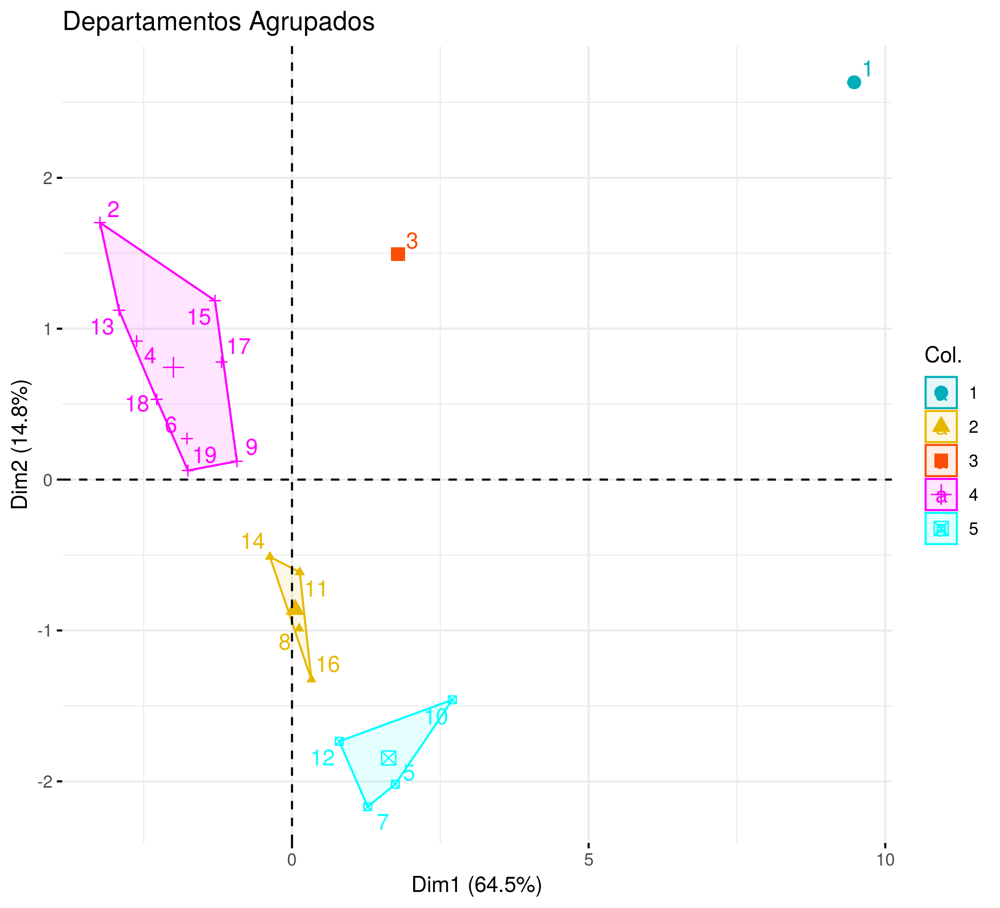
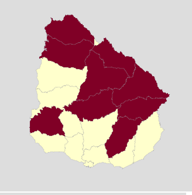
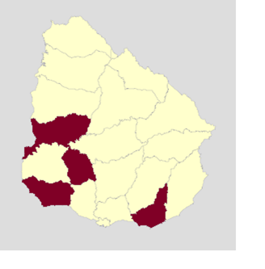
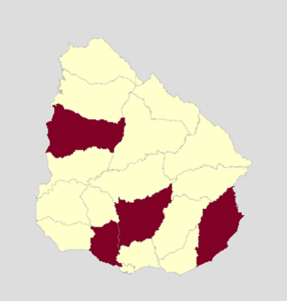

```{r setup, include=FALSE, echo = FALSE}
library(here)
library(dplyr)
library(knitr)
library(forcats)
library(ggplot2)
library(ggrepel)
list.files(here())
options(htmltools.dir.version = FALSE)
deptos <- readRDS(here('data', 'deptos_cluster_2.rds'))


# Graficos
deptos_grupos <- filter(deptos, grupo_2 %in% c(2, 4, 5)) %>%
  mutate(grupo_2 = fct_drop(grupo_2)) %>%
  mutate(grupo_3 = fct_relevel(grupo_3, "Rezagados", "Intermedio", "Despegados"))

indicador_agrupado <- function(df, indicador) {
  ggplot(df, aes_string("grupo_3", quo_name(enquo(indicador)), col = "grupo_3")) + 
    geom_point() + 
    geom_text_repel(aes(label = depto)) +
    guides(color = FALSE)
}
```


background-image: url("background.png")


# Presentación


- Importancia de usar datos objetivos para tomar definiciones de asignación de recursos

--

- Redundancia en el set de indicadores disponible a nivel departamental (pib per cápita, desarrollo humano, subempleo, etc.)

--

- Metodología para aprovechar la información disponible

--

- Agrupación de los departamentos de Uruguay en grupos de departamentos con valores similares de los indicadores analizados.

---

background-image: url("background.png")

# Metodología

- PCA
    - Permite usar información de muchas variables altamente correlacionadas
- Clusters
    - Permite agrupar departamentos similares
    
- Tomando los dos primeros componentes preservamos casi 80% de la información de todos los índices


---

background-image: url("background.png")


# Metodología (2)

.pull-left[
- Surgen varios grupos que se diferencian claramente
- Quedan tres grupos de departamentos internamente homogéneos

]

.pull-right[

]

---

background-image: url("background.png")

# Resultados

- Dos departamentos conforman un grupo de un departamento cada uno:

--

    - Montevideo
    - Canelones
    
--

- Se diferencian sobre todo por la población

---

background-image: url("background.png")

# Rezagados:

.pull-left[

```{r, echo = FALSE}
deptos %>% 
  filter(grupo_3 == "Rezagados") %>% 
  select(Departamento = depto) %>% 
  kable
```
]


.pull-right[


]


---

background-image: url("background.png")

# Despegados:

.pull-left[
```{r, echo = FALSE}
deptos %>% 
  filter(grupo_3 == "Despegados") %>% 
  select(Departamento = depto) %>% 
  kable
```
]


.pull-right[

]

---

background-image: url("background.png")

# Intermedios

.pull-left[
```{r, echo = FALSE}
deptos %>% 
  filter(grupo_3 == "Intermedio") %>% 
  select(Departamento = depto) %>% 
  kable
```
]

.pull-right[

]
---

background-image: url("background.png")


# PIB per Cápita

.pull-left[
Los despegados tiene mayores valores de PIB per cápita, los rezagados e intermedios tienen valores similares
]

.pull-right[
```{r, echo = FALSE}

pib <- indicador_agrupado(deptos_grupos, pib_per_capita)
pib


```
]


---

background-image: url("background.png")

# IDD


.pull-left[
Los despegados tiene mayores valores de PIB per cápita, rezagados e intermedios tienen valores similares.

]

.pull-right[


```{r echo = FALSE}
idd <- indicador_agrupado(deptos_grupos, idd)
idd

```

]

---

background-image: url("background.png")

# Subempleo

.pull-left[
Los rezagados están atrás, intermedios y despegados están similares

]

.pull-right[
```{r echo = FALSE}
sub <- indicador_agrupado(deptos_grupos, subempleo)
sub

```

]


---

background-image: url("background.png")

# Informalidad

.pull-left[
Los rezagados atrás, intermedios y despegados parejos.

]


.pull-right[
```{r echo = FALSE}
infor <- indicador_agrupado(deptos_grupos, informalidad)
infor
```
]


