```{r setup, include=FALSE, echo = FALSE}
library(here)
library(dplyr)
library(knitr)
list.files(here())
options(htmltools.dir.version = FALSE)


```

background-image: url("background.png")


# Taller Buenas Prácticas MyE

- ¿Qué son?
- Panorama Heterogéneo
- Manual

---
background-image: url("background.png")

# Contenidos

- Teoría del Cambio (R)
- Monitoreo de Indicadores (P)
- Evaluación (P + R)
- Checklist

---
background-image: url("background.png")

# Teoría del Cambio

+ Explicar la lógica de un programa
+ Base para indicadores
+ Base para evaluar

---
background-image: url("background.png")

# Teoría del Cambio

.center[
]


---
background-image: url("background.png")
# Contexto

+ Describir el problema y las fuentes de información
+ CCE: Encuesta MIPYMES, PIB Regional (IDAEs), ECH
+ Tres grupos de departamentos


---
background-image: url("background.png")
# PIB Departamental

.center[
]

---
background-image: url("background.png")
# Informalidad

.center[
]
---
background-image: url("background.png")
# Alcance y Foco

+ Alcance y prioridades del programa

---
background-image: url("background.png")
# Cadenas causales

+ Es la teoría atrás de la intervención
+ Es la parte central de la TdC
+ Las flechas implican vínculos causales


---
background-image: url("background.png")
# Cadenas Causales CCE


---
background-image: url("background.png")
# Recursos

+ Énfasis en transparencia

---
background-image: url("background.png")

# Actividades

+ ¿Qué hacemos?

---
background-image: url("background.png")
# Productos

+ ¿Qué se llevan los beneficiarios?

---
background-image: url("background.png")
# Resultados

+ ¿Qué hacen los beneficiarios con lo que les damos?
+ Más difícil de medir

---
background-image: url("background.png")
# Impacto

+ ¿Estamos moviendo la aguja?
+ Implica cambios a mayor escala
+ Extra difícil de medir (atribución)

---
background-image: url("background.png")
# 3 Teorías del Cambio

+ Identificar los componentes de la teoría del Cambio
+ Analizar la validez de los efectos causales
+ ¿En qué se enfoca más cada una?
+ ¿Las categorías son medibles?

---
background-image: url("background.png")
# Introducción Monitoreo

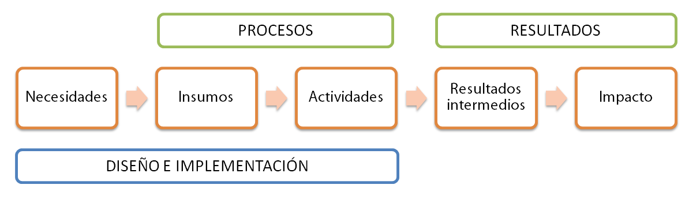


- Cadena de resultados articulada $\rightarrow$ mapa útil para seleccionar indicadores

- Indicadores $\rightarrow$ monitorear implementación + evaluar resultados 

---
background-image: url("background.png")

# ¿Qué es el monitoreo?

- Proceso continuo

- Medición del progreso hacia resultados o impacto

- El progreso no se mide directamente $\rightarrow$ metas + indicadores

- Monitoreo $\rightarrow$ no revelan por qué ocurrió ese nivel de rendimiento ni proporcionan explicaciones causales

---
background-image: url("background.png")

# Indicadores

- Hacen medible un concepto abstracto

- Variables cuantitativas o cualitativas

- Permiten de forma sencilla y confiable: 
      
      1) describir entorno de necesidades
      
      2) medir insumos 
      
      3) caracterizar implementación/procesos
      
      4) cuantificar resultados/impactos 

      5) registrar percepciones.
---
background-image: url("background.png")

# Indicadores SMART

1) **S** (Específico). Precisos $\rightarrow$ unidad de análisis + nivel de desagregación 

2) **M** (Medible). Fuente identificada. Objetivos. Replicables. 

3) **A** (Realista). ¿Es afectado por la intervención? ¿Los costos de construirlo son acordes a la intervención?

4) **R** (Relevante). Refleja objetivos.

5) **T** (Temporalidad): Horizonte temporal compatible.

---
background-image: url("background.png")
 
# Monitoreo + Indicadores

- ¿El programa o la política está funcionando?

- ¿Qué tan bien está funcionando un programa o una política?

- ¿Algún componente tiene un rendimiento mejor o peor que el promedio? 

---
background-image: url("background.png")
 
# Ejemplo: Red de Servicios de Desarrollo Empresarial

1) **OBJETIVOS**: responden a necesidades + especifican población objetivo

.center[
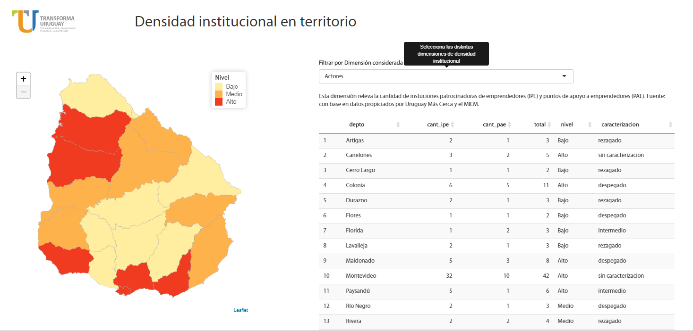]


---
background-image: url("background.png")
 
# Ejemplo: Articulación de TdC con indicadores

2) **INSUMOS/ACTIVIDADES**: ¿Qué puedo hacer para lograr objetivo?, Factibles

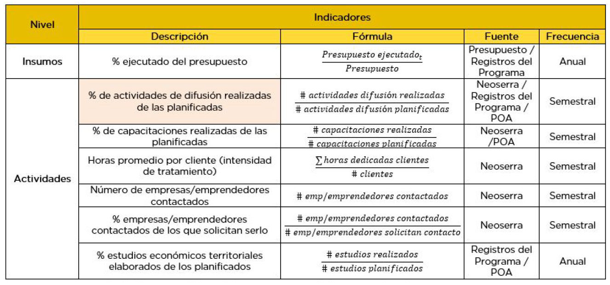
---
background-image: url("background.png")
 
# Ejemplo: Articulación de TdC con indicadores

3) **PRODUCTOS**: Consecuencia directa de la intervención. Representan el primer “resultado” observable de mi acción.

.center[
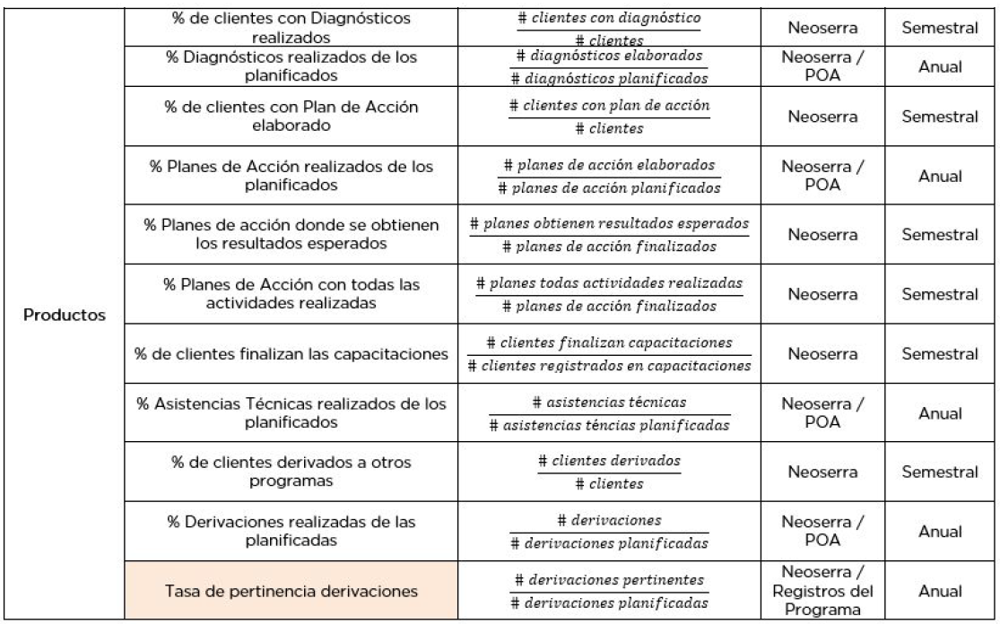]
---
background-image: url("background.png")
 
# Ejemplo: Articulación de TdC con indicadores

4) **RESULTADOS INTERMEDIOS**: Factores de transición que conectan los productos con los impactos.

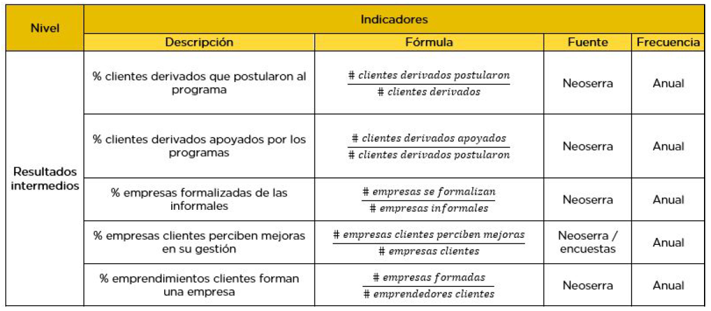
---
background-image: url("background.png")
 
# Ejemplo: Articulación de TdC con indicadores

5) **IMPACTO**: Lo que quiero cambiar con programa, Directamente relacionados con objetivos.

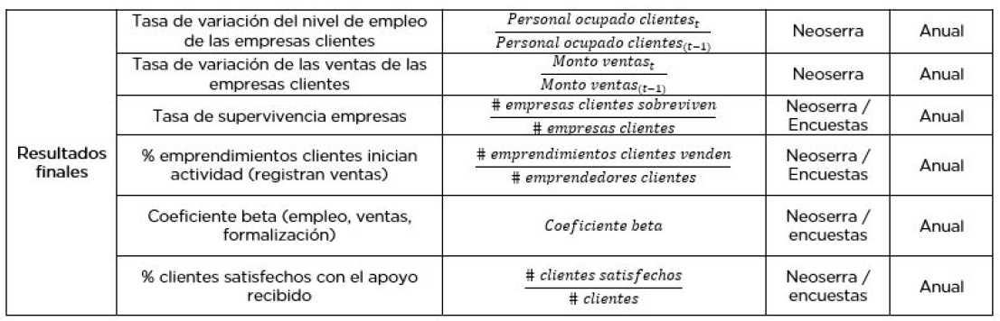
---
background-image: url("background.png")

# Evaluación

+ Ocasional
+ Planificación
+ Preguntas de evaluación
  + Descriptivas
  + Normativas
  + Causa-efecto
+ Distintas metodologías con distintos requerimientos de información
---
background-image: url("background.png")

# Evaluación de Impacto

- Pretenden responder estas preguntas de causa y efecto con precisión $\rightarrow$ evaluar el efecto causal del programa en esos resultados

- Preguntas de causa y efecto son habituales $\rightarrow$ contestarlas no es un asunto sencillo.

- Ayudan a superar el problema de atribuir causalidad $\rightarrow$ ¿en qué medida un programa concreto –y solo ese programa– contribuye a cambiar un resultado?
---
background-image: url("background.png")

# Correlación Espurias
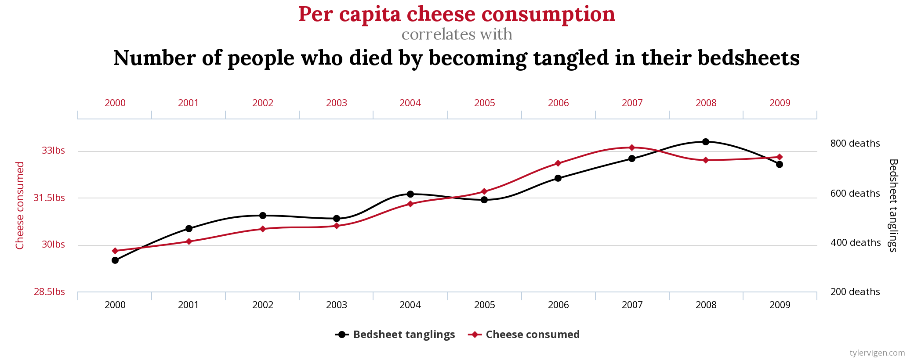
---
background-image: url("background.png")

# Correlación Espurias

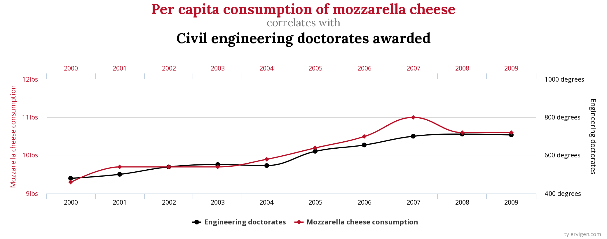
---
background-image: url("background.png")

# Falsos contrafactuales

**ANTES Y DESPUÉS**

- Comparación grupo antes y después de participar en un programa

- Si el programa no hubiera existido, el resultado para los participantes del programa habría sido igual a su situación antes del programa $\rightarrow$ **¡no suele suceder!**
---
background-image: url("background.png")

# Ejemplo: antes y después

.center[
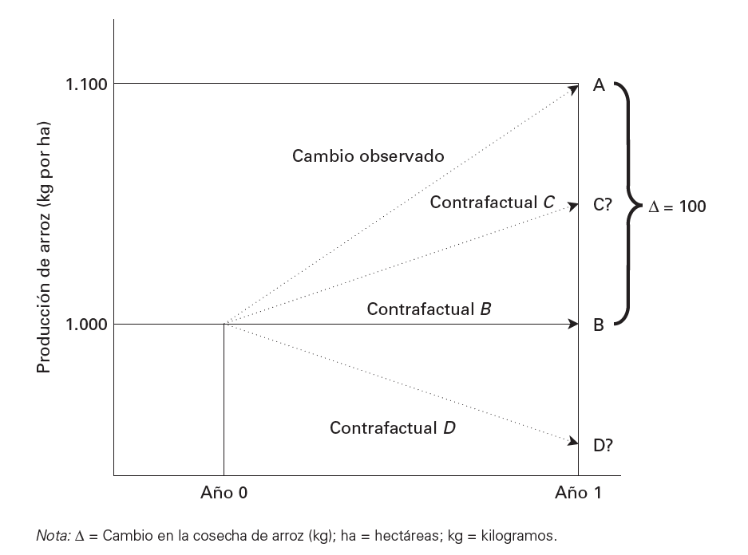]
---
background-image: url("background.png")

# Falsos Contrafactuales

**PARTICIPA/NO PARTICIPA**

- Comparan los resultados de un grupo que elige participar en un programa con otros de un grupo que elige no participar $\rightarrow$ ¡riesgoso!

- Sesgo de selección $\rightarrow$ participación se basa en las preferencias, decisiones o características no observables de los participantes potenciales.
---
background-image: url("background.png")

#Asignación aleatoria

- Utiliza un proceso al azar, para decidir a quién se le concederá acceso al programa y a quién no.

- Ese proceso producirá dos grupos que tienen una alta probabilidad de ser estadísticamente idénticos.

---
background-image: url("background.png")

# Ejemplo: asignación aleatoria

.center[
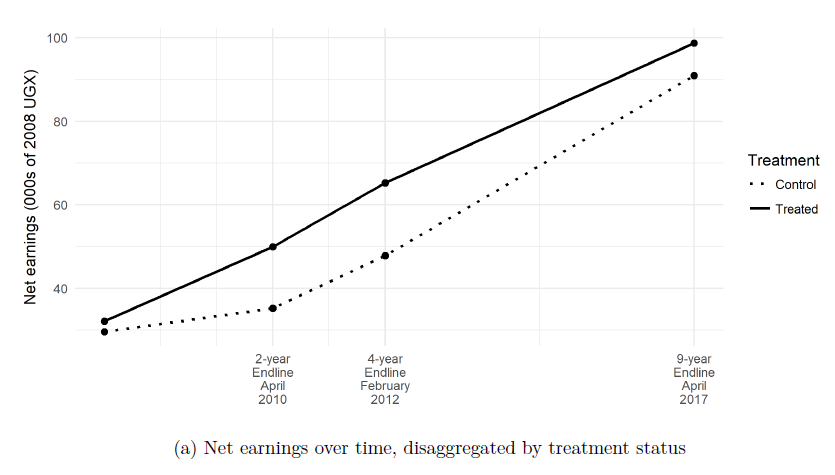]
---
background-image: url("background.png")
# Diferencias en diferencias

- Contrasta las diferencias en los resultados a lo largo del tiempo entre una población inscrita en un programa (el grupo de tratamiento) y una población no inscrita (el grupo de comparación).

- Combina los dos métodos de falsos contrafactuales.

- Supuesto fundamental $\rightarrow$ ¡tendencias paralelas!

---
background-image: url("background.png")

# Ejemplo 

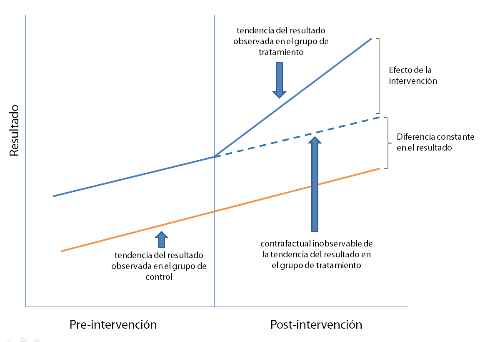

---
background-image: url("background.png")
# Regresión Discontinua


.pull-left[
+ Puntajes para elegir a los beneficiarios.
+ El grupo de control son los que quedan afuera por poco
+ El impacto estimado es el "salto"
]

--

.pull-right[

]


---
background-image: url("background.png")
# Control Sintético

+ Versión cuantitativa de Estudio de caso
--

+ Un solo tratado y grupo de control chico

--
+ Comparo con una combinación de los otros casos


---
background-image: url("background.png")
# Aplicación

+ Cluster de turismo en Colonia
+ Tratado: Colonia
+ Grupo de Control: (Montevideo + Maldonado)
+ Impacto es la diferencia después del tratamiento

---
# Resultados


